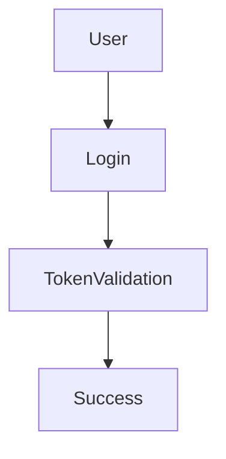

# Documentation Guidelines

## Project Documentation Maintenance Rules

### 1. Basic Principles

1. After each task, feature development, refactor, or bug fix, the corresponding documentation **must be updated**.
2. All documentation should use Markdown format (.md) to facilitate version control and readability.
3. Content should be clearly categorized with heading levels (#, ##, ###), avoiding overly long paragraphs.

### 2. Structure and Naming Conventions

1. Only `README.md` and `DOC_GUIDELINES.md` are allowed in the project root directory.
2. All other documentation must be stored in the `docs/` folder. Do not scatter files in other locations.
3. Naming rules:

- `README.md`: Project overview, introduction, architecture, installation steps, links to sub-docs
- `SETUP.md`: Environment setup instructions and dependency details
- `API_SPEC.md`: API descriptions, request/response formats, error codes
- `DB_SCHEMA.md`: Database table structure and field definitions
- `USER_FLOW.md`: User flows and UI-to-function mappings
- `TASK_LOG.md`: Daily task and bug logs with notes
- `[module]_MODULE.md`: Logic and data flow for individual modules (e.g., `chat_MODULE.md`)
- `CHANGELOG.md`: Version history (see section below)
- `MAINTAINERS.md`: Maintainers list and module responsibility breakdown

### 3. README.md Usage Rules

1. The README should only contain the project introduction, architecture overview, core module index, and quick start steps.
2. If the content exceeds 300 lines or contains large amounts of API/logic/flow diagrams, it **must be split** into multiple files with links listed in the README, e.g.:

```
## Table of Contents
- Environment Setup → docs/SETUP.md
- API Specifications → docs/API_SPEC.md
- Task Module → docs/task_MODULE.md
```

### 4. CHANGELOG.md Writing Rules

1. Location: should be stored in `docs/` or project root (preferably in `docs/`).
2. Every feature update, bug fix, refactor, or release must update the changelog.
3. Each entry should include: version number, date, and categorized changes.
4. Suggested format:

```
## [1.2.0] - 2025-06-27
### ✨ Added
- Added quest module with dynamic task flow

### 🔧 Changed
- Refactored login flow to integrate WebSocket and token validation

### 🐛 Fixed
- Fixed missing error message on first login failure
```

5. Recommended labels:

- ✨ Added: New features
- 🔧 Changed: Modifications or refactors
- 🐛 Fixed: Bug fixes
- 🗑 Removed: Removed features
- 🚧 Deprecated: Deprecated items
- 🔒 Security: Security fixes
- 📝 Docs: Documentation-only changes

### 5. Image and Diagram Management

1. All images should be stored under `docs/images/`.
2. Use the naming format: `[module]_[description].png`, e.g., `inventory_flow.png`.
3. Use tools like Mermaid or PlantUML to embed diagrams directly in Markdown. Example:



### 6. Update History Format

Each Markdown file should end with an update log like the following:

```
## 🔄 Update History
- 2025-06-27 by Ace: Initial version created
- 2025-07-01 by Ray: Added login flow diagram and explanation
```

### 7. Maintainer Responsibility System

1. Each module's documentation should be maintained by the primary developer responsible for that module.
2. For shared modules, create a `MAINTAINERS.md` to indicate contributors and their respective responsibilities.

Example:

```
Chat Module
- Lead: Ray
- Areas: Socket.io connection logic, message sync

Inventory Module
- Lead: Olivia
- Areas: Inventory sync, equipment logic
```

### 8. Additional Recommendations

1. Save this document as `DOC_GUIDELINES.md` in the root folder as the official reference for all team members.
2. Every Pull Request or merge should check whether related docs have been updated.
3. Leads should perform periodic reviews (e.g., every Monday) to ensure documentation matches actual features.

Good documentation is part of the product. Keeping it clean, complete, and readable is essential for a high-quality development process.

